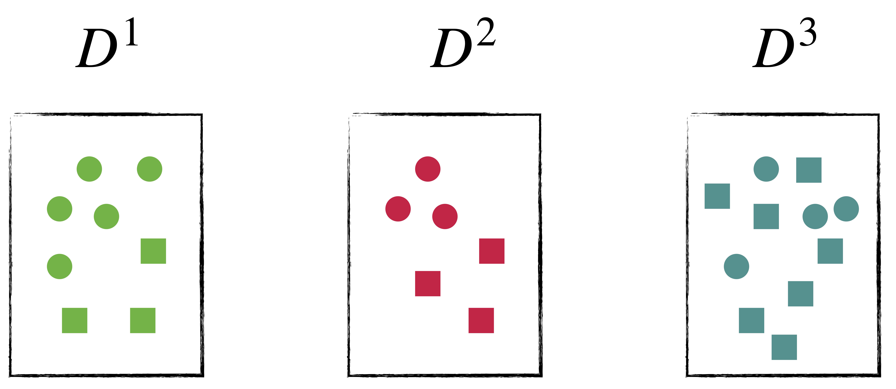

# 基本流程

## 信息增益

信息熵(information
entropy)是度量样本集合纯度最常用的一种指标。假设当前样本集合$D$中第$i$类样本所占的比例为$p_i$，则信息熵定义为：

$$
\mathbf{Ent}(D)=-\sum_{i=1}^{k}p_i\ln{p_i}
$$

其中$\mathbf{Ent}(D)$的值越小，$D$的纯度就越高。

假设离散属性$a$有$V$个可能的取值$\{a^1,a^2,...,a^V \}$，若使用$a$对样本集进行划分，则会产生$V$个分支结点，其中第$v$个支点包含了$D$中所有在属性$a$上取值为$a^v$的样本，记作$D^v$。再考虑到不同的分支结点所包含的样本数不同，给分支结点赋予权重$\frac{D^v}{D}$，即样本数越多，对分支结点的影响越大，于是计算出用属性$a$对样本集进行划分所获得的信息增益(information
gain)：

$$
\mathbf{Gain}(D,a)=\mathbf{Ent}(D)-\sum_{v=1}^{V}\frac{|D^{v}|}{|D|}\mathbf{Ent}(D^v)
$$

注意：在选择好一个属性后，要更新数据集$D$，直到满足以下条件停止划分：

1.  所剩样本标签相同，无需划分。
2.  无属性可用，少数服从多数。
3.  样本量为 0，无需划分。

{width="300"}

在此例子中：

1.  样本个数为$25$，样本类型为$2$，即：$13$个正方形(S)、$12$个圆形(C)
2.  在属性$a$中有三个结点，分别用绿色、红色、蓝色表示
3.  结点$D^{1}$中：$3$个正方形，$4$个圆形
4.  结点$D^{2}$中：$3$个正方形，$3$个圆形
5.  结点$D^{3}$中：$7$个正方形，$3$个圆形

总信息熵为：

$$
\mathbf{Ent}(D)= - \left ( \frac{12}{25}\ln\frac{12}{25} + \frac{13}{25}\ln\frac{13}{25} \right)
$$ 三个结点的信息熵：

$$
\begin{aligned}
\mathbf{Ent}(D^1) &= -\left(\frac{3}{7}\ln\frac{3}{7} + \frac{4}{7}\ln\frac{4}{7} \right)\\
\mathbf{Ent}(D^2) &= -\left(\frac{3}{6}\ln\frac{3}{6} + \frac{3}{6}\ln\frac{3}{6}  \right)\\
\mathbf{Ent}(D^3) &= -\left(\frac{7}{10}\ln\frac{3}{10} + \frac{3}{10}\ln\frac{3}{10}  \right)\\
\end{aligned}
$$

信息增益：

$$
\mathbf{Gain}(D,a) = \mathbf{Ent}(D) - \left(\mathbf{Ent}(D^1) + \mathbf{Ent}(D^2) + \mathbf{Ent}(D^3)\right )
$$

## 信息增益率

信息增益会对数目多的属性有所偏好，为减少这种偏好的影响，著名的$\mathrm{C4.5}$采用增益率(gain
ratio)来选择最优属性：

$$
\begin{aligned}
\mathbf{Gain\_ratio}(D,a)&=\frac{\mathbf{Gain}(D,a)}{\mathbf{IV}(a)}\\
\mathbf{IV}(a)& = \sum_{v=1}^{V}\frac{|D^{v}|}{|D|}\ln\frac{D^v}{D}
\end{aligned}
$$
从中可以看出$\mathbf{IV}(a)$是属性的固有值，属性$a$的可能取值数目越大，$\mathbf{IV}(a)$值就会越大。但是需要注意的是，增益率对可取值较少的属性有所偏好，因此$\mathrm{C4.5}$算法并不是直接选择增益率大的候选划分属性，而是先从候选划分属性中找出信息增益高于平均水平的属性，再从中选择增益率最高的。

在上个例子中：

$$
\sum_{v=1}^{V}\frac{|D^{v}|}{|D|}\ln\frac{D^v}{D}=\frac{8}{25} + \frac{6}{25} + \frac{11}{25}
$$

信息增益和信息增益率：

```{python}
import numpy as np

x1 = np.array([[3, 5], [2, 7], [1, 3]])  # 不同值多
x2 = np.array([[2, 8], [4, 7]])  # 不同值少

# 信息增益
p1 = x1 / np.sum(x1, axis=1).reshape(-1, 1)
y1 = -np.sum(p1 * np.log(p1), axis=1)
y1 = np.sum(np.sum(x1, axis=1) / np.sum(x1) * y1)

p2 = x2 / np.sum(x2, axis=1).reshape(-1, 1)
y2 = -np.sum(p2 * np.log(p2), axis=1)
y2 = np.sum(np.sum(x2, axis=1) / np.sum(x2) * y2)

print(y1)
print(y2)

# 信息增益率
iv1 = np.sum(-np.sum(x1, axis=1) / np.sum(x1) *
             np.log(np.sum(x1, axis=1) / np.sum(x1)))
iv2 = np.sum(-np.sum(x2, axis=1) / np.sum(x2) *
             np.log(np.sum(x2, axis=1) / np.sum(x2)))

y1 = y1 / iv1
y2 = y2 / iv2

print(y1)
print(y2)
```

## 基尼指数

Classification and Regression (CART)决策树使用的是基尼指数(Gini
index)来划分属性。数据集$D$的纯度可用基尼值度量：

$$
\mathbf{Gini}(D) = 1-\sum_{i=1}^{k}p_k^2
$$

直观来说，$\mathbf{Gini}(D)$反应的是从数据集中随机抽取两个样本，其类别标记不一致的概率，因此$\mathbf{Gini}(D)$越小，数据集$D$的纯度越高。属性$a$的基尼指数定义为：

$$
\mathbf{Gini\_index}(D,a)=\sum_{v=1}^{V}\frac{|D^{v}|}{|D|}\mathbf{Gini}(D^v)
$$

因此在候选属性集合$A$中，选择那个使得划分后基尼指数最小的属性作为最优划分属性。
