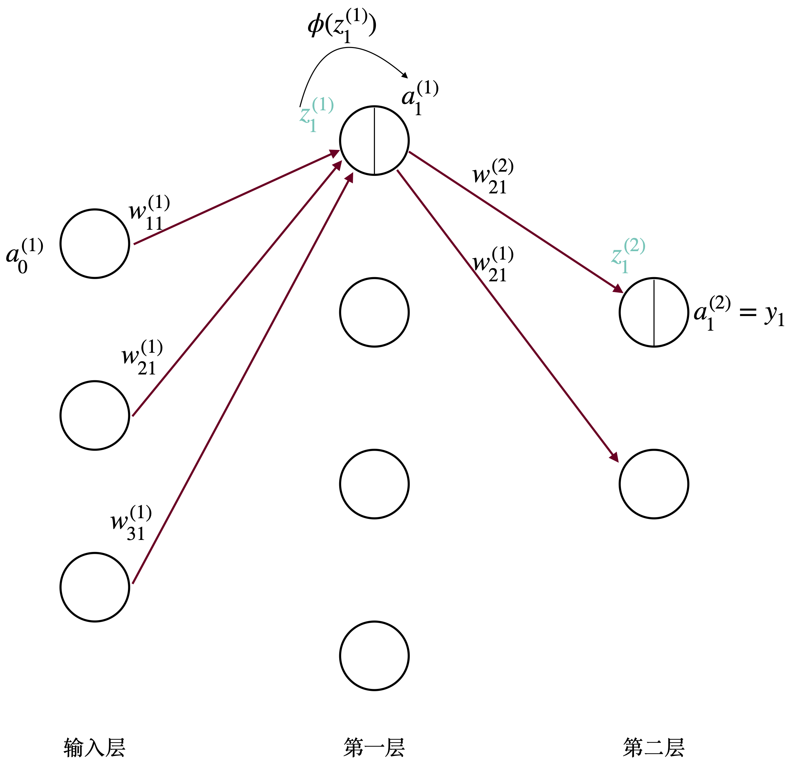

## 后向传播(Back propgation)


### 数学表示

#### 数学符号

1.  网络共$l$层，输入层不算，输出层为第$l$层。
2.  $z^{(k)}=w^{(k)}a^{(k-1)}+b^{(k)}$，$a^{(k)}=\phi (z^{(k)})$，$k$表示层数，假设第$k$层神经元个数为$3$，那么$z^{(k)}$和$a^{(k)}$的向量为$3$维。
3.  $b_i^{(k)}$，$z_i^{(k)}$，$a_i^{(k)}$中，$i$表示第$k$层的第$i$个分量。
4.  $b^{(k)}$的维数和第$k$层的神经元一致。
5.  $w_{ij}^{k}$表示第$k-1$层中第$i$个神经元和第$k$层中第$j$个神经元的权值。假设第$k-1$和第$k$层分别有$p$和$q$个神经元，即`w.shape=(p,q)`。
6.  注意，$z^{(k)}$是由第$k$层的$w^{(k)}$，$b^{(k)}$和第$k-1$层的$a^{(k-1)}$求得而来。

### 运算过程



$$
\begin{aligned}
a^{(0)}w^{(1)} + b^{(1)} &= z^{(1)} \xrightarrow[]{\phi(z^{(1)})}  a^{(1)}\\ 
a^{(1)}w^{(2)} + b^{(2)} &= z^{(2)} \xrightarrow[]{\phi(z^{(2)})}  a^{(2)}\\
\vdots \\
a^{(m-1)}w^{(m)} + b^{(m)} &= z^{(m)} \xrightarrow[]{\phi(z^{(m)})}  a^{(m)}\\
a^{(m)}w^{(m+1)} + b^{(m+1)} &= z^{(m+1)} \xrightarrow[]{\phi(z^{(m+1)})}  a^{(m+1)}\\
\vdots \\
a^{(l-1)}w^{(l)} + b^{(l)} &= z^{(l)} \xrightarrow[]{\phi(z^{(l)})}  a^{(l)} =y\\
\end{aligned}
$$

其中，输入向量$x=a^{(0)}$。注意，激活后的$a$作为下一层的输入。

#### 回归更新公式


在反向求导中，最重要的是求出$\frac{\partial E}{\partial z_i^{(m)}}$。假设$\delta _i^{(m)} = \frac{\partial E}{\partial z_i^{m}}$

回归代价函数如下：

$$
L=-\frac{1}{2n}\sum_{i=1}^{n}(y_i-Y_i)^2
$$


$$
\begin{aligned}
\textbf{Special:} \delta _i^{(l)} &=\frac{\partial E}{\partial z_i^{(l)}}= \frac{\partial E}{\partial y_i}\frac{\partial y_i}{\partial z_i^{l}}\\
&=(y_i-Y_i))\\
\textbf{General:} \delta _i^{(m)} &=\frac{\partial E}{\partial z_i^{(m)}}= \frac{\partial E}{\partial a_i^{(m)}} \frac{\partial a_i^{(m)}}{\partial z_i^{(m)}}\\
&= \left ( \left( \sum_{j=1}^{k}\delta _j^{(m+1)}\right)w_{ij}^{(m+1)} \right )  \cdot \phi^{'}(z_i^{(m)})
\end{aligned}
$$

其中$k$为第$m+1$层的神经元个数，$1 \leq m+1 \leq l-1$。此处需要注意的是，在对$a_{i}^{(m)}$进行求导的时候，凡是含有和$a_{i}^{(m)}$项的都要包含在内，即$z_{1}^{m+1} \to z_{k}^{m+1}$都要包括），$\frac{\partial E}{\partial a_i^{(m)}}$的计算方法如下：

$$
\begin{aligned}
\frac{\partial E}{\partial a_i^{(m)}}&=\frac{\partial \delta_{1}^{(m+1)}}{\partial a_i^{(m)}}
+\frac{\partial \delta_{2}^{(m+1)}}{\partial a_i^{(m)}}+...+\frac{\partial \delta_{k}^{(m+1)}}{\partial a_i^{(m)}}\\
&=\delta_{1}^{(m+1)}w_{i1}+\delta_{2}^{(m+1)}w_{i2}+...+\delta_{k}^{(m+1)}w_{ik}\\
& = \left( \sum_{j=1}^{k}\delta _j^{(m+1)} \right) w_{ij}^{(m+1)}
\end{aligned}
$$

$w$和$b$的偏导公式如下：

$$
\begin{aligned}
\frac{\partial E}{\partial w_{ij}^{(m+1)}} &=\delta _j{^{(m+1)}}a_i^{(m)}\\
\frac{\partial E}{\partial b_{i}^{(m+1)}} &=\delta _j{^{(m+1)}}
\end{aligned}
$$

其中，$i$为第$m-1$层的第$i$个神经元个数；$j$为第$m$层的第$j$个神经元个数

更新公式如下：

$$
\begin{aligned}
w_{ij}^{(m)} &:= w_{ij}^{(m)}-\frac{\partial E}{\partial w_{ij}^{(m)}}\\
b_{i}^{(m)} &:= b_{i}^{(m)}-\frac{\partial E}{\partial b_{i}^{(m)}}\\
\end{aligned}
$$

参数更新矩阵化：

1.  中间层有$l_1$，$l_2$两层，分别有$p$，$q$个神经元。
2.  输入层：$n$个样本，$m$个维度。即输入为`X.shape=(n,m)`。
3.  输出层：$n$个样本，$k$个分类。即输出为`Y.shape=(n,k)`。
4.  输入层到$l_1$：$w^{(1)}$的矩阵形状为`w1.shape=(m,p)`，其中$w^{(1)}_{ij}$表示
    输入层的第$i$个神经元和$l_1$的第$j$个神经元连接的系数值。
    此时矩阵的形状为`nmmp=(n,p)`。$b$的形状为`(p,1)`。
5.  $l_1$到$l_2$：$w^{(2)}$的矩阵形状为`w2.shape=(p,q)`，其中$w^{(2)}_{ij}$表示$l_1$的第$i$个神经元和$l_2$的第$j$个神经元连接的系数值。
    此时矩阵的形状为`nppq=(n,q)`。$b^{(1)}$的形状为`(q,1)`。
6.  $l_2$到输出层：$w^{(3)}$的矩阵形状为`w3.shape=(q,k)`，其中$w^{(3)}_{ij}$表示$l_2$的第$i$个神经元和输出层的第$j$个神经元连接的系数值。
    此时矩阵的形状为`nbbk=(n,k)`。$b^{(2)}$的形状为`(k,1)`。

$$
\begin{aligned}
\delta ^{(l)} &=\frac{\partial E}{\partial z^{(l)}}= \frac{\partial E}{\partial y}\frac{\partial y_i}{\partial z^{(l)}}\\
&=(y-Y)\\
\delta ^{(m)} &=\frac{\partial E}{\partial z^{(m)}}= \frac{\partial E}{\partial a^{(m)}} \frac{\partial a^{(m)}}{\partial z^{(m)}}\\
&= \left ( w^{(m+1)}\delta^{(m+1)} \right )  \phi^{'}(z^{(m)})
\end{aligned}
$$

$w$和$b$的偏导公式如下：

$$
\begin{aligned}
\frac{\partial E}{\partial w^{(m)}} &=\delta{^{(m)}}a^{(m-1)}\\
\frac{\partial E}{\partial b^{(m)}} &=\delta{^{(m)}}
\end{aligned}
$$

更新公式如下：

$$
\begin{aligned}
w^{(m)} &:= w^{(m)}-\frac{\partial E}{\partial w^{(m)}}\\
b^{(m)} &:= b^{(m)}-\frac{\partial E}{\partial b^{(m)}}\\
\end{aligned}
$$

具体流程可参考：<https://www.cnblogs.com/charlotte77/p/5629865.html>


#### 分类更新公式


softmax 公式如下：

$$
a_j^{(l)} = \frac{\exp{z_j^{(l)}}}{\sum_{i=1}^{k}\exp{z_i^{(l)}}}
$$
其中$k$为分类的个数，$j$为第$j$个类别。分类代价如下(softmax)：

$$
L=-\sum_{i=1}^{k}y_i\ln a_i^{(l)}
$$

和回归任务中一样，最重要的是求出在反向求导中，最重要的是求出$\frac{\partial  L}{\partial z_i^{(m)}}$。假设$\delta _i^{(m)} = \frac{\partial L}{\partial z_i^{(m)}}$

对于最后一层求$\frac{\partial L}{\partial a_q^{(l)}}$：

$$
\frac{\partial L}{\partial a_q^{(l)}}=-\frac{y_q}{a_q^{(l)}}
$$

对于最后一层求$\frac{\partial a_q^{(l)}}{\partial z_p^{(l)}}$，其中$q$为激活后的第$q$个神经元，$p$为激活前的第$p$个神经元：

$$
\begin{aligned}
\frac{\partial a_q^{(l)}}{\partial z_p^{(l)}}&=
\frac{\partial \left(\frac{\exp{z_q^{(l)}}}{\sum_{i=1}^{k}\exp{z_i^{(l)}}}\right)}{\partial z_p^{(l)}}\\
&=\begin{cases}
\frac{ -\exp{z_q^{(l)}}\exp{z_p^{(l)}}} {\left ( \sum_{i=1}^{k}\exp{z_i^{(l)}} \right )^2 }=-a_q^{(l)}a_p^{(l)},\,p^{(l)}\ne q^{(l)}\\
\frac{ \exp{z_p^{(l)}}-\exp{z_q^{(l)}}\exp{z_p^{(l)}}} {\left ( \sum_{i=1}^{k}\exp{z_i^{(l)}} \right )^2 }=-a_q^{(l)}(a_q^{(l)}-1),\,p^{(l)}= q^{(l)}\\
\end{cases}
\end{aligned}
$$

至此，对于最后一层：$\delta _i^{(l)} = \frac{\partial L}{\partial z_i^{(l)}}$已求出：

$$
\begin{aligned}
\delta _p^{(l)} &= \frac{\partial L}{\partial z_p^{(l)}}\\
&=\begin{cases}
y_qa_p^{(l)},\,p^{(l)}\ne q^{(l)}\\
y_q(a_p^{(l)}-1),\,p^{(l)}= q^{(l)}\\
\end{cases}
\end{aligned}
$$

其余的部分和回归完全一样。


### BP 算法流程

1.  随机初始化`(w,b)`
2.  前后传播：根据训练样本`(X,Y)`，代入网络可求出所有的`(z,a,y)`
3.  链式求偏导，最小化：$E=\frac{1}{2}\Vert y-Y \Vert^2$

## 参数设置

### 随机梯度下降(stochstic gradient descent, SGD)

1.  不用每输入一个样本就去变换参数，而是输入一批样本（batch 或者
    mini-batch），求出这些样本的梯度平均值后，根据这个平均值改变参数。
2.  在神经网络训练中，batch 的样本数大致设置为 50-200.

#### batch normalization

基本思想：既然希望每一层获得的值都在$0$附近，从而避免梯度消失现象，那么为什么不直接把每一层的值做基于均值和方差的归一化呢。

### 正则项

$$
L(w) = \frac{1}{2}\left( \sum_{i=1}^{batch\_size}\Vert y_i - Y_i \Vert ^2   + \lambda \sum_{}^{}w_{k,l}^2   \right)
$$

## 神经网络的优缺点

## 代码

### 非矩阵化

```python
import numpy as np

def sigmoid(X): # 激活函数
    return 1 / (1 + np.exp(-X))


def deriv_sigmoid(X): # 激活函数求导
    a = sigmoid(X)
    return a * (1 - a)


def mse_loss(y_pre, y): # 损失
    return ((y_pre - y)**2).mean()


class ANN:
    def __init__(self):

        # 第一层参数
        self.w1 = np.random.normal()
        self.w2 = np.random.normal()
        self.w3 = np.random.normal()
        self.w4 = np.random.normal()
        self.b1 = np.random.normal()
        self.b2 = np.random.normal()

        # 第二层参数
        self.w5 = np.random.normal()
        self.w6 = np.random.normal()
        self.b3 = np.random.normal()

    def feed_forward(self, X):

        a1 = sigmoid(self.w1 * X[0] + self.w2 * X[1] + self.b1)
        a2 = sigmoid(self.w3 * X[0] + self.w4 * X[1] + self.b2)

        y_pre = sigmoid(self.w5 * a1 + self.w6 * a2 + self.b3)
        return y_pre

    def train(self, X, Y, learning_rate=0.03, num=500):

        for i in range(num):
            for x, y in zip(X, Y):

                # 前向传播
                z1 = self.w1 * x[0] + self.w2 * x[1] + self.b1
                a1 = sigmoid(z1)

                z2 = self.w3 * x[0] + self.w4 * x[1] + self.b2
                a2 = sigmoid(z2)

                z3 = self.w5 * a1 + self.w6 * a2 + self.b3
                y_pre = sigmoid(z3)  # 预测结果

                # z 的偏导
                Ez3 = 2 * (y_pre - y) * deriv_sigmoid(z3)

                # 第二层 w 的偏导
                Ew5 = Ez3 * a1
                Ew6 = Ez3 * a2
                Eb3 = Ez3
                self.w5 -= learning_rate * Ew5
                self.w6 -= learning_rate * Ew6
                self.b3 -= learning_rate * Eb3

                # z 的偏导
                Ez1 = Ez3 * self.w5
                Ez2 = Ez3 * self.w6

                # 第一层 w 的偏导 (重点!!!)
                Ew1 = (Ez1 + Ez2) * x[0]
                Ew2 = (Ez1 + Ez2) * x[1]
                Ew3 = (Ez1 + Ez2) * x[0]
                Ew4 = (Ez1 + Ez2) * x[1]
                Eb1 = (Ez1 + Ez2)
                Eb2 = (Ez1 + Ez2)

                # 更新参数
                self.w1 -= learning_rate * Ew1
                self.w2 -= learning_rate * Ew2
                self.w3 -= learning_rate * Ew3
                self.w4 -= learning_rate * Ew4
                self.b1 -= learning_rate * Eb1
                self.b2 -= learning_rate * Eb2
                
            if i % 10 == 0:
                loss = mse_loss(Y, np.apply_along_axis(self.feed_forward, 1, X))
                print("Epoch %d loss: %.3f" % (i, loss))


# Define dataset
data = np.array([
    [-2, -1],  
    [25, 6],  
    [17, 4],  
    [-15, -6],  
])

Y = np.array([
    1,  
    0,  
    0,  
    1,  
])

# Train our neural network!
network = ANN()
network.train(data, Y)
```

### 矩阵化